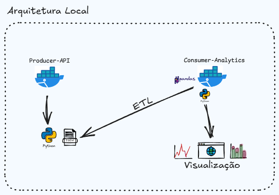

# :bulb: ETL Microservices

<p align="justify">
  Um projeto onde uma aplicação atua como um micro serviço(servidor API), devolvendo como resposta um JSON com dados fake.
  Outra aplicação roda em paralelo com o papel de extrair, transformar e carregar os dados; executar uma aplicação web onde é servido esses dados em forma de gráficos.
</p><br />

## :wrench: Infra-estrutura

<br /><br />

## :computer: Tecnologias utilizadas

<div>
  
  <br />
  
  
  <br />
  
  
</div><br />

## :hammer: Instalação

> [!IMPORTANT]
> É preciso ter docker e git instalado na sua máquina
<br />

> [!IMPORTANT]
> Renomear o arquivo '.env.example' dentro da pasta services/consumer-analytics para '.env'
<br />

- Clonar o repositorio:
```bash
  git clone https://github.com/gunners-pro/etl-microservices
```
<br />

- Entrar na pasta do projeto:
```bash
  cd etl-microservices
```
<br />

- Subir os containers docker:
```bash
  docker compose up -d
```
<br />

- Abrir a aplicação no navegador de internet:
```bash
  digite a url http://localhost:5001
```
<br />
<br />
